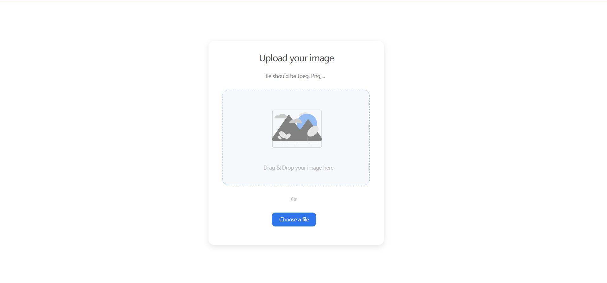

<h1 align="center">ImageUploader</h1>

<div align="center">
   A simple but useful tool to upload images.
</div>

<div align="center">
  <h3>
    <a href="https://{your-demo-link.your-domain}">
      Demo
    </a>
    <span> | </span>
    <a href="https://{your-url-to-the-solution}">
      Solution
    </a>
    <span> | </span>
    <a href="https://devchallenges.io/challenges/O2iGT9yBd6xZBrOcVirx">
      Challenge
    </a>
  </h3>
</div>

<!-- TABLE OF CONTENTS -->

## Table of Contents

- [Overview](#overview)
  - [Built With](#built-with)
- [Features](#features)
- [How to use](#how-to-use)
- [Contact](#contact)

<!-- OVERVIEW -->

## Overview
select an image

uploading

uploaded successfully


What you can do with this project?
* you can drag and drop an image to upload it
* you can choose to select an image from your folder
* you can see a loader when uploading
* When the image is uploaded, you can see the image and copy its url
* you can choose to copy the url to the clipboard


### Built With

<!-- This section should list any major frameworks that you built your project using. Here are a few examples.-->

- [Vue.js](https://vuejs.org/)
- [Java](https://tailwindcss.com/)
- [SpringBoot](https://tailwindcss.com/)

## Features

<!-- List the features of your application or follow the template. Don't share the figma file here :) -->


## How To Use

<!-- Example: -->

To clone and run this application, you'll need [Git](https://git-scm.com) and [Node.js](https://nodejs.org/en/download/) (which comes with [npm](http://npmjs.com)) installed on your computer. From your command line:

```bash
# Clone this repository
$ git clone https://github.com/your-user-name/your-project-name

# Install dependencies
$ npm install

# Run the app
$ npm start
```

## Contact

- Website [your-website.com](https://{your-web-site-link})
- GitHub [mvpsheng](https://{github.com/your-usermame})


